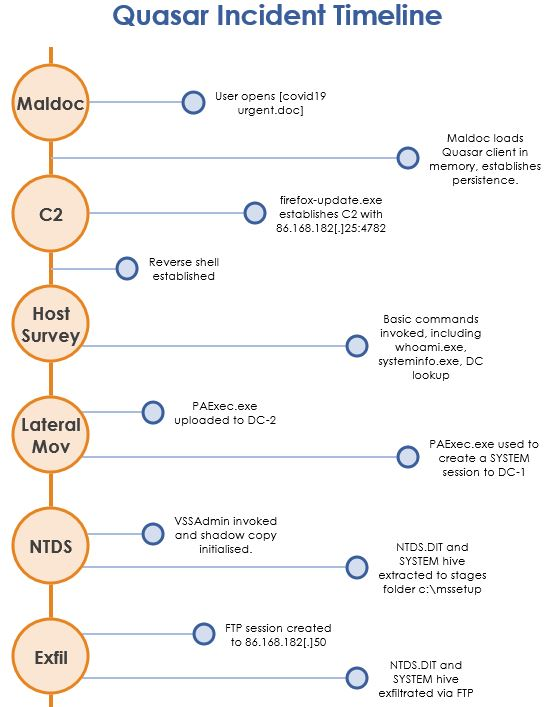

# Exercise: Quasar
**Date:** 18/08/2020

## What was the name of the malicious document?
+ covid19 urgent.doc
+ \[EventRecordID 2555\] shows the document invoking an executable

## What was the name of the malware?
+ Quasar \[EventRecordID 2555\]

## What is the temporary file name?
+ C:\Users\admin1\RTYXHpfAgvMk.exe \[EventRecordID 2555\]

## Where does the malware persist?
+ C:\Users\admin1\AppData\Roaming\firefox-update.exe \[EventRecordID 2556\]

## What is the MD5 hash for the malware (binary)?
+ 1F365640A47E85139F3323F7A2BE1D46

## How does the malware automatically start?
+ HKU\S-1-5-21-3074105254-2518822297-1841647002-2102\SOFTWARE\Microsoft\Windows\CurrentVersion\Run\Quasar Client Startup
+ \[EventRecordID 2560\]

## What IPv4 address and port does the malware connect to? 
+ 86.168.182\[.\]25:4782
+ \[EventRecordID 2561\] SysMon EVTID 3 - Network connection detected

## What domains are contacted?
+ tools.keycdn\[.\]com
+ api.ipify\[.\]org

## What commands are invoked by the attacker on DC2 host?
+ Whoami /privs
+ Whoami /groups
+ Systeminfo
+ Tasklist
+ Arp -a
+ nltest  /dclist:blue.lab
+ ping  dc1.blue.acme -n 1
+ ping  dc1.blue.lab -n 1

## What is the name of the file created on DC-2?
+ C:\ssetup\paexec.exe \[EVTID 11 - file created\]

## What did the attacker use the file created on DC-2 for?
+ Establish connection to DC-1. 
+ paexec  \\192.168.112\[.\]140 -s cmd.exe
+ This creates a shell (system) to DC-1.
+ This can be correlated with \[EventRecordID 77\] on DC-1. Evidence of C:\Windows\PAExec-6256-DC2.exe being instantiated and shell created \[NT AUTHORITY\SYSTEM\].

## What commands are invoked by the attacker on DC1 host?
+ Whoami
+ vssadmin  create shadow /for=C:
+ ftp

## What was the purpose of invoking the process starting with 'v'?
+ Creates a snapshot of the file system. Provides the ability to access system/locked files, a technique favoured by adversaries to access NTDS.DIT.

## What was the adversary IP address used to connect via FTP?
+ 86.168.182\[.\]50 \[EventRecordID 116\]

## What folder was used for staging?
+ C:\mssetup\

## List the MITRE ATT&CK TTPs
+ T1204.002 - User Execution: Malicious File
+ T1547.001 - Boot or Logon Autostart Execution: Registry Run Keys / Startup Folder
+ T1571 - Non-Standard Port 
+ T1033 - System Owner/User Discovery
+ T1057 - Process Discovery 
+ T1082 - System Information Discovery 
+ T1105 - Ingress Tool Transfer 
+ T1021.002 - Remote Services: SMB/Windows Admin Shares
+ T1003.003 - OS Credential Dumping: NTDS 
+ T1048 - Exfiltration Over Alternative Protocol

## Produce a timeline of the events

## Document any limitations or gaps or issues
+ Not possible to see file transfer activity and the commands used in the FTP session. FTP commands would be logged on the attacker FTP server [not client side].
+ Logs doesn’t capture the file created events
+ Sysmon not configured correctly for host 192.168.112\[.\]141. There are repeated messages in the events: Either the component that raises this event is not installed on your local computer or the installation is corrupted. You can install or repair the component on the local computer.

## Document any attacker mistakes
+ A mistake was made where the incorrect host was pinged, should have been dc1.blue.lab not dc1.blue.acme
+ \[EventRecordID 2578\] evidence that a tool PAExec was invoked remotely [temp file C:\Users\admin1\AppData\Local\Temp\QSzCCLeRXndP.exe]. Likely that this failed - should be uploaded to local host.
+ Forensic evidence left behind on DC-1, the folder c:\mssetup. In this scenario, a vigilant user spotted an unidentified folder and raised an incident.

# References
The following advisories may assist:
+ [US CERT - Quasar Open-Source Remote Administration Tool](https://us-cert.cisa.gov/ncas/analysis-reports/AR18-352A)
+ [PAExec](https://www2.poweradmin.com/paexec/)
+ [TrustWave - NTDS](https://www.trustwave.com/en-us/resources/blogs/spiderlabs-blog/tutorial-for-ntds-goodness-vssadmin-wmis-ntdsdit-system/)
+ [Microsoft - Vol Shadow Copy](https://docs.microsoft.com/en-us/windows-server/storage/file-server/volume-shadow-copy-service)
+ [UltimateWindowsSecurity - Extracting Password Hashes from the Ntds.dit File](https://www.ultimatewindowssecurity.com/blog/default.aspx?d=10/2017)
