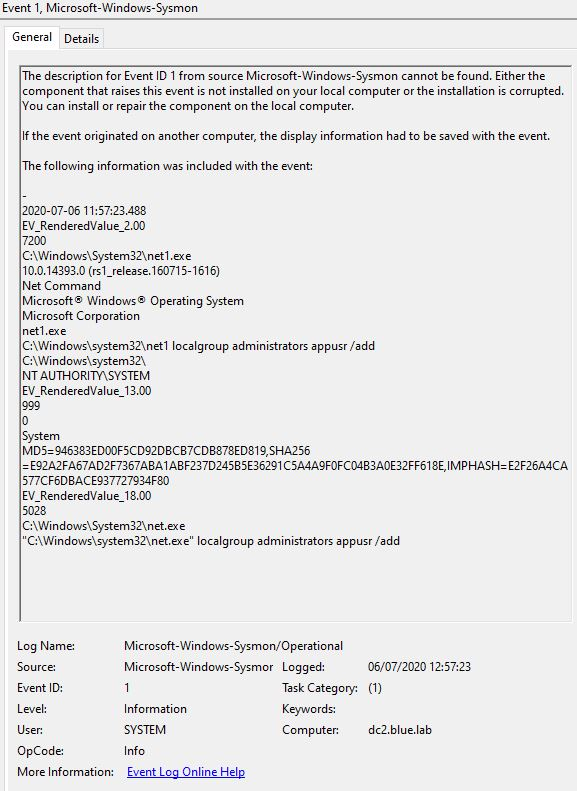

# Exercise: WebShell - Solution
**Date:** 09/08/2020

## Attacker IP addresses?

There are 2:
86.168.182\[.\]25 - This is used for web site recon
86.168.182\[.\]10 - Used for remote access

## Attacker User Agent string?

There are 2:
+ Mozilla/5.0+(Windows+NT+10.0;+Win64;+x64)+AppleWebKit/537.36+(KHTML,+like+Gecko)+Chrome/83.0.4103.61+Safari/537.36
+ Mozilla/5.0+(X11;+Linux+x86_64;+rv:68.0)+Gecko/20100101+Firefox/68.0

## What was the vulnerable web page?

*upload.aspx*

The last 10 rows in the iis.log shows interactions with upload.aspx. This differs from the recon activity. It is likely this was used by the attacker to gain a foothold.

## Name of malicious file uploaded?

*iis.aspx* was one malicious file uploaded. This file wasn't detected as part of the recon, thus it can be concluded that this was uploaded. A filesystem check would detect the creation date.

We know that from the sysmon log at 12:42 *cmd.exe /c net user* was invoked, parent process *w3wp.exe* (IIS). However the IIS log doesn't have accurate timestamps. An assumption that this was a webshell being invoked.

## What tools were uploaded onto the server?

Check sysmon log

+ c:\logs\jp.exe \[event record ID 1076\]
+ c:\logs\pe-shell.bat \[event record ID 1077\]
+ http://86.168.182\[.\]10:7890/shell2.ps1 \[event record ID 1079\]

## What was the utility of the tools?

Using sysmon log, hashes are captured \[event record ID 1076\].

808502752CA0492ACA995E9B620D507B *jp.exe* \[JuicyPotato\], a local privilege escalation tool. Search this hash reveals that this is a common technique. [FoxKitten](https://www.clearskysec.com/wp-content/uploads/2020/02/ClearSky-Fox-Kitten-Campaign.pdf)

*pe-shell.bat* was likely used to launch *shell2.ps1*. This created a remote PowerShell session to the attacker machine \[reverse shell\].

## Were any changes made to the server i.e. config changes to accounts etc?

There was an attempt to add a user to the local administrators group - sysmon eventID 1086. This doesn't appear have been successful, as there were no account creation events in the security audit log.

Two files added to c:\logs folder, *pe-shell.bat* and *jp.exe*

## We noticed a lot of random http requests in the log. What tool was used?

The IIS log shows enumeration activity against the web site. This is the recon stage and is designed to understand the implementation of the web site, specifically for vulnerabilities. The tool used is burpsuite. In the log there are a number of references to burpcollaborator\[.\]net. Look up this domain:

*"Burp Collaborator Server*

*Burp Collaborator is a service that is used by Burp Suite when testing web applications for security vulnerabilities."*

## Any recommendations to harden the host?

+ Application level, ensure that the upload.aspx page implements safe checks, only permitting certain file types, depending on the need i.e. JPG etc.
+ Web server, prevent directory browsing, and execution of code from IIS AppPool account.
+ Implement firewall to drop outbound powershell activity.
+ Implement application allow/deny list - this would prevent execution of JuciyPotato for example.
+ Not so much as a hardening, implement NTP to enable time sync (important for logging). I.e. IIS logs dont record accurate time of events.
+ Implement Powershell script logging.

## What information was gathered?

+ whoami and associated privileges \[whoami /priv\]
+ list of users \[cmd net user\]
+ system information \[systeminfo\]

## Method of attack (ATT&CK technique)

+ T1505.003 - [Webshell](https://attack.mitre.org/techniques/T1505/003/)
+ T1082 - [System Information Discovery](https://attack.mitre.org/techniques/T1082/)
+ T1033 - [System Owner/User Discovery](https://attack.mitre.org/techniques/T1033/)
+ T1136.001 - [Create Account: Local Account](https://attack.mitre.org/techniques/T1136/001/)
+ T1059.001 - [Command and Scripting Interpreter: PowerShell](https://attack.mitre.org/techniques/T1059/001/)

## Establish time line of events

## What IoCs could be used?

**Attacker IPs:**
+ 86.168.182\[.\]25
+ 86.168.182\[.\]10

**Tools hashes:**
+ 808502752CA0492ACA995E9B620D507B

**Filenames:**
+ jp.exe
+ pe-shell.bat
+ iis.aspx

Note, filenames could result in false positives.

**Username - attempt at adding to local group:**
+ appusr

## What SIEM correlation rules could be used to detect the attack earlier?

+ Parent process of w3wp.exe followed by commandline/child process of cmd.exe, whoami.exe, systeminfo.exe. 
+ [SIGMA rule](https://github.com/Neo23x0/sigma/blob/master/rules/windows/process_creation/win_webshell_detection.yml)
+ [NSA list of suspicious applications](https://github.com/nsacyber/Mitigating-Web-Shells)
+ [Page 3 lists suspicious processes called by w3wp.exe](https://media.defense.gov/2020/Jun/09/2002313081/-1/-1/0/CSI-DETECT-AND-PREVENT-WEB-SHELL-MALWARE-20200422.PDF)

## Produce an incident report detailing the attack and recommendations.

Incident report would summarise the above, covering the facts and observed events. Usually there would be a prioritisation applied, however this is determined by the organisation i.e. severity of incident based on impact etc, P1, P2, P3 would be designated and have different response times, i.e. P1 would be a high severity, and could require urgent intervention.

**Incident Summary**
+ Host compromise - \[IIS Webserver/192.168.112.141\] by an external unknown actor, via exploitation of vulnerable web services. 

**Date/Time of Incident**
+ 06/07/2020 11:42:24 (UTC) - Actor achieved initial access to host \[192.168.112.141\] and conducted host survey.

**Detection**
+ Security monitoring (SIEM) detected an attempt to create a local administrator account on host 192.168.112.141. This was unsuccessful. Further analysis observed activity including website enumeration, privilege escalation, remote host connectivity via Powershell and upload of files to the host. 
+ The SIEM alert: *ALERT: P1 - Administrator Account Created or Modified.*

**Indicators of Compromise**
+ 86.168.182[.]25
+ 86.168.182[.]10:7890

+ c:\logs\jp.exe
+ c:\logs\pe-shell.bat

**Status/Stage**
+ Incident is ongoing.

**Impact**
+ Incident affecting critical systems or information with potential to be revenue or customer impacting.

**Incident Category**
+ Compromised Asset

**Assets Affected**
+ IIS Webserver/192.168.112.141

**Recommendations/Response**
+ Isolate compromised asset IIS Webserver/192.168.112.141
+ Undertake DFIR on assets
+ Enable heightened monitoring of assets including retrospective analysis/sweep
+ Determine IOCs from compromise artifacts
+ Restore compromised asset to original state and apply preventative measures (vulnerabilty mitigation)

**Source Data**
The following raw event generated the SIEM alert

## References ##
+ [FIRST Incident clasification](https://www.first.org/resources/guides/csirt_case_classification.html)
+ [Kaspersky Incident response example](https://media.kasperskycontenthub.com/wp-content/uploads/sites/43/2018/03/07171449/Incident_Response_Guide_eng.pdf)
+ [NIST Guide for Cybersecurity Event Recovery](https://nvlpubs.nist.gov/nistpubs/SpecialPublications/NIST.SP.800-184.pdf)
+ [NIST Computer Security Incident Handling Guide p58](https://nvlpubs.nist.gov/nistpubs/SpecialPublications/NIST.SP.800-61r2.pdf)
